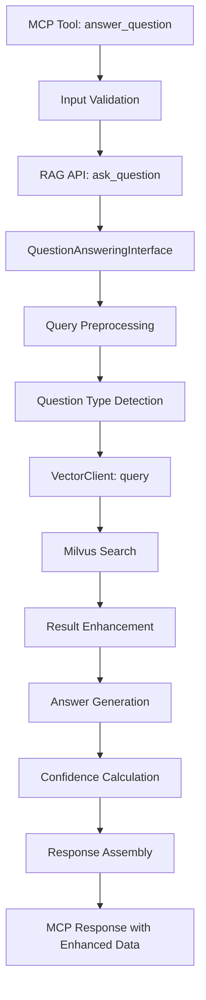
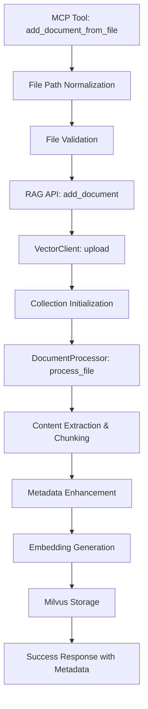
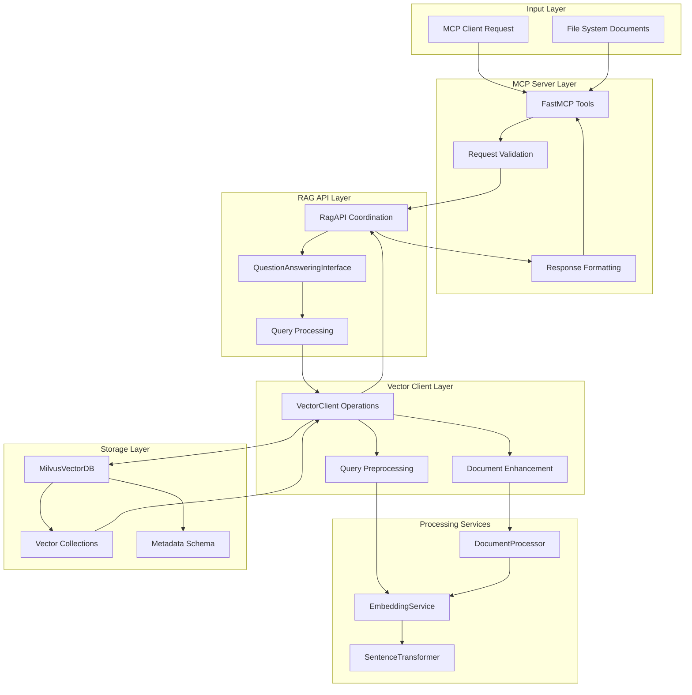
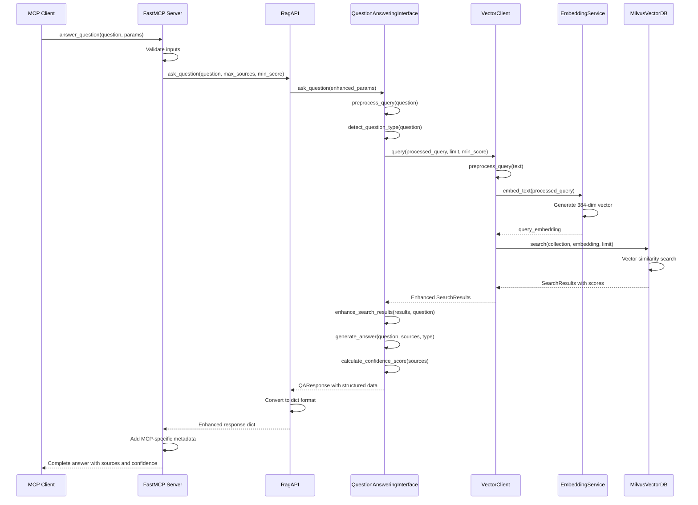
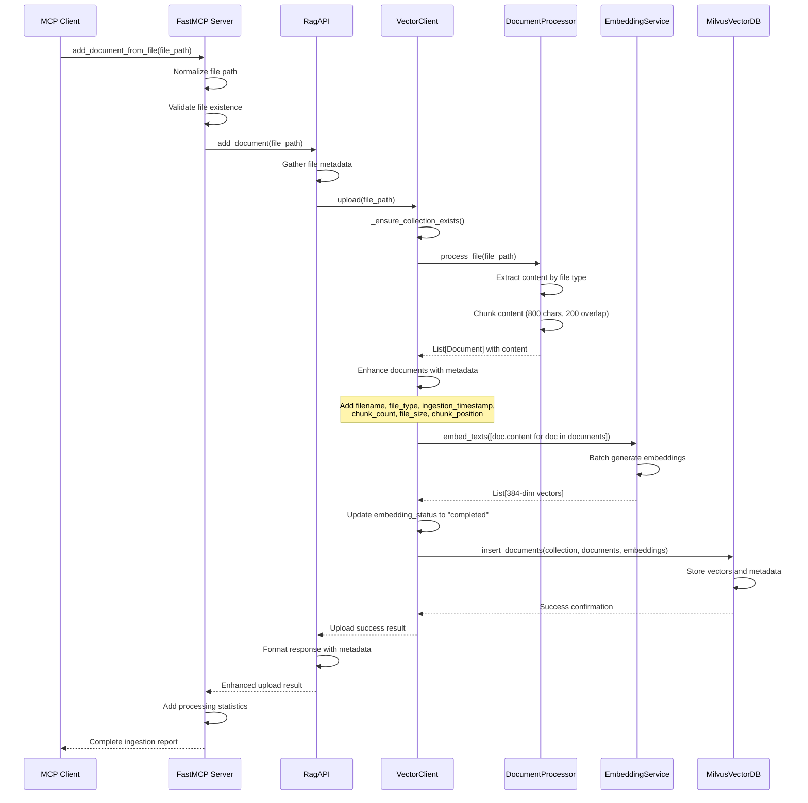

# MCP RAG Playground System Architecture and Flow Documentation

## Table of Contents

1. [System Architecture Overview](#system-architecture-overview)
2. [Main Flow Documentation](#main-flow-documentation)
3. [Component Responsibilities](#component-responsibilities)
4. [Data Flow Diagrams](#data-flow-diagrams)
5. [API Interface Documentation](#api-interface-documentation)
6. [Error Handling Patterns](#error-handling-patterns)
7. [Performance Considerations](#performance-considerations)
8. [Integration Points](#integration-points)

## System Architecture Overview

The MCP RAG Playground is a Python 3.9 system that provides Retrieval-Augmented Generation (RAG) capabilities through a Model Context Protocol (MCP) server interface. The system follows SOLID principles with a dependency injection architecture and supports comprehensive document lifecycle management with enhanced metadata tracking.

### High-Level Architecture

The system is organized into several key layers:

```
┌─────────────────────────────────────────────────────────────┐
│                    MCP Server Layer                         │
│  (rag_server.py - FastMCP with 11 tools)                  │
├─────────────────────────────────────────────────────────────┤
│                   RAG API Layer                            │
│  (RagAPI + QuestionAnsweringInterface)                    │
├─────────────────────────────────────────────────────────────┤
│                  Vector Client Layer                       │
│  (VectorClient - abstracts vector operations)             │
├─────────────────────────────────────────────────────────────┤
│               Vector Database Layer                        │
│  (MilvusVectorDB implementation)                           │
├─────────────────────────────────────────────────────────────┤
│           Supporting Services Layer                        │
│  (EmbeddingService, DocumentProcessor, Config)            │
└─────────────────────────────────────────────────────────────┘
```

### Core Design Principles

1. **SOLID Compliance**: Each component has a single responsibility with clear interfaces
2. **Dependency Injection**: Production container manages all dependencies
3. **Abstract Interfaces**: VectorDBInterface allows for different vector database implementations
4. **Enhanced Metadata**: Comprehensive document tracking throughout the lifecycle
5. **Error Resilience**: Robust error handling at each layer with graceful degradation

## Main Flow Documentation

### 1. Enhanced Question Answering Flow (`answer_question`)

The `answer_question` flow represents the system's primary intelligent query processing capability, providing context-aware responses with source attribution.

#### Flow Overview



#### Detailed Step-by-Step Process

**Step 1: MCP Tool Entry Point**
- Location: `rag_server.py:answer_question()`
- Input validation (question, max_sources, min_score parameters)
- Parameter sanitization and boundary checking

**Step 2: RAG API Coordination**
- Location: `rag_api.py:ask_question()`
- Delegates to QuestionAnsweringInterface for enhanced processing
- Converts QAResponse to dictionary format for MCP compatibility

**Step 3: Enhanced Query Processing**
- Location: `qa_interface.py:ask_question()`
- Query preprocessing and expansion
- Question type detection (factual, procedural, boolean, general)
- Keyword extraction for context analysis

**Step 4: Vector Search Execution**
- Location: `vector_client.py:query()`
- Query preprocessing (abbreviation expansion, normalization)
- Embedding generation via SentenceTransformer
- Milvus vector similarity search

**Step 5: Result Enhancement**
- Location: `qa_interface.py:_enhance_search_results()`
- Context extraction based on question keywords
- Relevance explanation generation
- Citation formatting with metadata

**Step 6: Answer Generation**
- Question type-specific answer formatting
- Multi-source content synthesis
- Source attribution and citation integration

**Step 7: Response Assembly**
- Confidence score calculation based on source quality
- Query suggestion generation
- Comprehensive metadata compilation

#### Data Transformations

```
Raw Question String
    ↓ (preprocessing)
Normalized Query + Keywords + Question Type
    ↓ (embedding)
Vector Representation (384-dimensional)
    ↓ (search)
Raw SearchResults with scores
    ↓ (enhancement)
EnhancedSearchResults with context and citations
    ↓ (generation)
Structured QAResponse with answer and metadata
    ↓ (formatting)
MCP-compatible dictionary response
```

### 2. Document Ingestion Flow (`add_document_from_file`)

The document ingestion flow handles the complete lifecycle of adding documents to the knowledge base with comprehensive metadata tracking.

#### Flow Overview



#### Detailed Step-by-Step Process

**Step 1: MCP Tool Entry Point**
- Location: `rag_server.py:add_document_from_file()`
- Cross-platform file path normalization (Windows/WSL compatibility)
- File existence validation and size analysis
- Processing time estimation for large files

**Step 2: RAG API Coordination**
- Location: `rag_api.py:add_document()`
- File metadata gathering (filename, type, size)
- Orchestrates the upload process through VectorClient

**Step 3: Vector Client Processing**
- Location: `vector_client.py:upload()`
- Collection existence verification/creation
- Document processing delegation
- Metadata enhancement coordination

**Step 4: Document Processing**
- Location: `document_processor.py:process_file()`
- Content extraction from 15+ file formats
- Intelligent chunking (800 chars with 200 char overlap)
- Document object creation with initial metadata

**Step 5: Metadata Enhancement**
- Location: `vector_client.py:upload()`
- Addition of comprehensive tracking fields:
  - `filename`: Base filename for reference
  - `file_type`: File extension with leading dot
  - `ingestion_timestamp`: ISO timestamp of processing
  - `chunk_count`: Total number of chunks created
  - `file_size`: Original file size in bytes
  - `chunk_position`: Position within the document (0-indexed)
  - `embedding_status`: Processing status tracking

**Step 6: Embedding Generation**
- Location: `embedding_service.py:embed_texts()`
- Batch embedding generation using SentenceTransformer
- 384-dimensional vector creation for each chunk
- Embedding status updates

**Step 7: Vector Database Storage**
- Location: `milvus_client.py:insert_documents()`
- Milvus collection insertion with vectors and metadata
- Automatic ID generation and assignment
- Transaction-safe storage operations

#### Data Transformations

```
File Path String
    ↓ (normalization)
Validated File Path + Basic Metadata
    ↓ (processing)
Document Chunks + Content
    ↓ (enhancement)
Enhanced Document Objects with Full Metadata
    ↓ (embedding)
Document Objects + 384-dim Vectors
    ↓ (storage)
Stored Documents with Generated IDs
    ↓ (response)
Success Response with Processing Statistics
```

## Component Responsibilities

### MCP Server Layer

**Component**: `rag_server.py` (FastMCP)
- **Primary Responsibility**: MCP protocol interface and tool orchestration
- **Key Functions**:
  - Tool parameter validation and sanitization
  - Cross-platform file path normalization
  - Request routing to appropriate RAG API methods
  - Response formatting for MCP compatibility
  - Context management through FastMCP lifespan
- **Dependencies**: RagAPI, logging configuration
- **Error Handling**: Input validation, exception wrapping, user-friendly error messages

### RAG API Layer

**Component**: `RagAPI` (`rag_api.py`)
- **Primary Responsibility**: High-level RAG operation coordination
- **Key Functions**:
  - Document lifecycle management (add, remove, batch operations)
  - Query coordination between vector search and Q&A processing
  - Collection management and information retrieval
  - Result formatting and metadata enrichment
- **Dependencies**: VectorClient, QuestionAnsweringInterface
- **Error Handling**: Operation-level error recovery, detailed error reporting

**Component**: `QuestionAnsweringInterface` (`qa_interface.py`)
- **Primary Responsibility**: Enhanced question processing and answer generation
- **Key Functions**:
  - Natural language query preprocessing and analysis
  - Question type detection and categorization
  - Context-aware answer generation with source attribution
  - Confidence scoring and query suggestion generation
- **Dependencies**: VectorClient, QueryProcessor utilities
- **Error Handling**: Query processing fallbacks, graceful degradation

### Vector Client Layer

**Component**: `VectorClient` (`vector_client.py`)
- **Primary Responsibility**: Vector database operation abstraction
- **Key Functions**:
  - Document upload coordination with metadata enhancement
  - Query preprocessing and semantic search execution
  - Collection lifecycle management (create, delete, info)
  - Document management (retrieve, remove by ID)
- **Dependencies**: VectorDBInterface, EmbeddingService, DocumentProcessor
- **Error Handling**: Connection management, operation retries, state validation

### Vector Database Layer

**Component**: `MilvusVectorDB` (Milvus implementation)
- **Primary Responsibility**: Concrete vector database operations
- **Key Functions**:
  - Collection schema management with enhanced metadata fields
  - Vector storage and retrieval operations
  - Similarity search with configurable parameters
  - Connection management and health monitoring
- **Dependencies**: Milvus client, schema configuration
- **Error Handling**: Connection errors, schema validation, operation failures

### Supporting Services Layer

**Component**: `SentenceTransformerEmbedding` (`embedding_service.py`)
- **Primary Responsibility**: Text-to-vector conversion
- **Key Functions**:
  - Batch text embedding generation
  - Model management and optimization
  - Dimension consistency validation
- **Dependencies**: SentenceTransformers library
- **Error Handling**: Model loading failures, embedding generation errors

**Component**: `DocumentProcessor` (`document_processor.py`)
- **Primary Responsibility**: File content extraction and chunking
- **Key Functions**:
  - Multi-format file content extraction (15+ formats)
  - Intelligent text chunking with configurable overlap
  - Content normalization and cleaning
- **Dependencies**: File processing libraries
- **Error Handling**: Unsupported formats, content extraction failures

**Component**: `Container` (Dependency Injection)
- **Primary Responsibility**: Production dependency management
- **Key Functions**:
  - Singleton instance management
  - Configuration-driven component assembly
  - Production-optimized service instantiation
- **Dependencies**: dependency-injector library
- **Error Handling**: Configuration errors, instantiation failures

## Data Flow Diagrams

### Overall System Data Flow



### Enhanced Question Answering Data Flow



### Document Ingestion Data Flow



## API Interface Documentation

The MCP RAG Playground exposes 11 MCP tools through the FastMCP server. Each tool provides specific functionality with comprehensive parameter validation and error handling.

### Document Management Tools

#### `add_document_from_file`

**Purpose**: Add a document to the knowledge base from a file with intelligent processing.

**Parameters**:
- `file_path` (str): Absolute or relative path to the file to add to the knowledge base

**Supported File Types**: `.txt`, `.md`, `.py`, `.js`, `.ts`, `.json`, `.yaml`, `.css`, `.html`, `.xml`, `.toml`, `.ini`, `.log`

**Returns**:
```python
{
    "success": bool,           # Operation success status
    "file_path": str,          # Original file path
    "normalized_path": str,    # Platform-normalized path
    "filename": str,           # Base filename
    "file_size": int,          # File size in bytes
    "processing_time_seconds": float,  # Time taken to process
    "message": str,            # Human-readable status message
    "error": str              # Error details if failed (optional)
}
```

**Example Usage**:
```python
result = add_document_from_file("/path/to/manual.md")
```

#### `add_document_from_content`

**Purpose**: Add a document to the knowledge base from raw text content with custom metadata.

**Parameters**:
- `content` (str): The raw text content to add to the knowledge base
- `metadata` (Dict[str, Any], optional): Custom metadata key-value pairs

**Returns**:
```python
{
    "success": bool,
    "content_length": int,
    "metadata": Dict[str, Any],
    "message": str,
    "error": str              # If failed (optional)
}
```

**Example Usage**:
```python
result = add_document_from_content(
    "Python is a programming language...",
    {"source": "tutorial", "topic": "python"}
)
```

#### `batch_add_documents_from_files`

**Purpose**: Add multiple documents in a single batch operation.

**Parameters**:
- `file_paths` (List[str]): List of file paths to add (maximum 100 files)

**Returns**:
```python
{
    "success": bool,           # True only if all files succeeded
    "total_files": int,
    "successful_files": int,
    "failed_files": int,
    "results": List[Dict],     # Individual file results
    "message": str,
    "errors": List[str]        # Error messages for failed files
}
```

### Query and Search Tools

#### `answer_question`

**Purpose**: Answer natural language questions with synthesized responses and source citations.

**Parameters**:
- `question` (str): Natural language question to ask
- `max_sources` (int, default=5): Maximum number of source documents (1-10)
- `include_citations` (bool, default=True): Whether to include source citations
- `min_score` (float, default=0.3): Minimum similarity score threshold (0.0-1.0)

**Returns**:
```python
{
    "success": bool,
    "question": str,
    "answer": str,             # Generated answer with source attribution
    "sources": List[Dict],     # Enhanced search results with citations
    "confidence_score": float, # Answer confidence (0.0-1.0)
    "processing_time": float,
    "suggestions": List[str],  # Query refinement suggestions
    "metadata": Dict[str, Any],
    "tool_used": "answer_question",
    "response_type": "enhanced_qa",
    "citation_count": int,
    "quality_indicator": str   # "high_confidence", "good_confidence", etc.
}
```

**Example Usage**:
```python
result = answer_question(
    "How do I configure SSL?",
    max_sources=3,
    min_score=0.5
)
```

#### `find_documents`

**Purpose**: Search for specific documents using keyword/semantic similarity.

**Parameters**:
- `query` (str): Search query text
- `limit` (int, default=5): Maximum number of results to return
- `min_score` (float, default=0.0): Minimum similarity score threshold

**Returns**:
```python
{
    "success": bool,
    "query": str,
    "total_results": int,
    "limit": int,
    "min_score": float,
    "results": List[Dict]      # Search results with content and metadata
}
```

### Document Information Tools

#### `get_document_metadata`

**Purpose**: Retrieve comprehensive metadata for a specific document by its ID.

**Parameters**:
- `document_id` (str): Unique identifier of the document

**Returns**:
```python
{
    "success": bool,
    "document_id": str,
    "metadata": {
        "document_id": str,
        "filename": str,
        "file_type": str,
        "ingestion_timestamp": str,
        "chunk_count": int,
        "file_size": int,
        "chunk_position": int,
        "vector_id": str,
        "embedding_status": str,
        "content_length": int
    },
    "content_preview": str,    # First 200 characters
    "error": str              # If failed (optional)
}
```

#### `list_documents_with_metadata`

**Purpose**: List all documents in the knowledge base with their metadata.

**Parameters**:
- `limit` (int, default=20): Maximum number of documents to return (1-100)
- `file_type_filter` (str, optional): File extension filter (e.g., ".py", ".md")

**Returns**:
```python
{
    "success": bool,
    "total_found": int,
    "returned_count": int,
    "limit": int,
    "file_type_filter": str,
    "documents": List[Dict],   # Document metadata objects
    "summary": {
        "file_types": Dict[str, int],      # File type counts
        "ingestion_dates": Dict[str, int], # Date counts
        "total_documents": int,
        "unique_files": int
    }
}
```

### Document Removal Tools

#### `remove_document_from_knowledge_base`

**Purpose**: Remove a specific document from the knowledge base by its ID.

**Parameters**:
- `document_id` (str): Unique identifier of the document to remove

**Returns**:
```python
{
    "success": bool,
    "document_id": str,
    "message": str,
    "error": str              # If failed (optional)
}
```

#### `batch_remove_documents_from_knowledge_base`

**Purpose**: Remove multiple documents in a batch operation.

**Parameters**:
- `document_ids` (List[str]): List of document IDs to remove (maximum 1000)

**Returns**:
```python
{
    "success": bool,           # True only if all removals succeeded
    "total_documents": int,
    "successful_removals": int,
    "failed_removals": int,
    "results": List[Dict],     # Individual removal results
    "message": str,
    "errors": List[str]        # Error messages for failed removals
}
```

### Collection Management Tools

#### `delete_collection`

**Purpose**: ⚠️ DESTRUCTIVE OPERATION - Permanently delete the entire knowledge base collection.

**Parameters**: None

**Returns**:
```python
{
    "success": bool,
    "collection_name": str,
    "message": str,
    "error": str              # If failed (optional)
}
```

**⚠️ Warning**: This operation is IRREVERSIBLE and will completely remove all documents, metadata, embeddings, and indices.

## Error Handling Patterns

The system implements a comprehensive error handling strategy with multiple layers of protection and graceful degradation.

### Error Handling Hierarchy

#### 1. Input Validation Layer

**Location**: MCP tool entry points in `rag_server.py`

**Pattern**: Pre-execution validation with detailed error messages
```python
# Parameter validation
if not question or not question.strip():
    return {
        "success": False,
        "error": "Question cannot be empty",
        "suggestions": ["Enter a clear, specific question"]
    }

# Boundary checking
if max_sources < 1 or max_sources > 10:
    return {
        "success": False,
        "error": "max_sources must be between 1 and 10"
    }
```

**Error Types Handled**:
- Empty or invalid parameters
- Type mismatches
- Boundary violations
- File path issues (cross-platform compatibility)

#### 2. Operation Layer Error Handling

**Location**: RAG API and QuestionAnsweringInterface

**Pattern**: Try-catch with operation-specific error recovery
```python
try:
    # Core operation logic
    result = self.vector_client.upload(file_path)
    if not result:
        return {"success": False, "error": "Upload failed"}
except Exception as e:
    logger.error(f"Error uploading file {file_path}: {e}")
    return {
        "success": False,
        "error": str(e),
        "file_path": file_path
    }
```

**Error Types Handled**:
- File processing failures
- Database operation errors
- Embedding generation issues
- Query processing exceptions

#### 3. Service Layer Error Handling

**Location**: VectorClient, EmbeddingService, DocumentProcessor

**Pattern**: Robust error handling with state management
```python
def query(self, query_text: str, limit: int = 5, min_score: float = 0.0):
    try:
        self._ensure_collection_exists()
        # Query processing
        return filtered_results
    except Exception as e:
        logger.error(f"Error querying database: {e}")
        return []  # Graceful degradation
```

**Error Types Handled**:
- Connection failures
- Collection initialization errors
- Embedding model issues
- File format processing errors

#### 4. Database Layer Error Handling

**Location**: MilvusVectorDB implementation

**Pattern**: Connection management and operation retries
```python
def test_connection(self) -> bool:
    try:
        # Connection test logic
        return success
    except Exception as e:
        logger.error(f"Connection test failed: {e}")
        return False
```

**Error Types Handled**:
- Network connectivity issues
- Database unavailability
- Schema validation errors
- Transaction failures

### Error Response Standardization

All components return standardized error responses that include:

```python
{
    "success": False,
    "error": "Descriptive error message",
    "error_type": "category_of_error",  # When applicable
    "suggestions": ["Action user can take"],
    "context": {  # Additional debugging context
        "operation": "operation_name",
        "parameters": {...},
        "timestamp": "ISO_timestamp"
    }
}
```

### Graceful Degradation Strategies

#### 1. Query Processing Fallbacks

When enhanced Q&A processing fails, the system falls back to basic search:
- Question preprocessing errors → Use original query
- Answer generation failures → Return raw search results
- Confidence calculation issues → Return 0.0 confidence with warning

#### 2. Document Processing Resilience

For batch operations, individual failures don't prevent processing of other items:
- Failed file uploads are logged but don't stop batch processing
- Unsupported file types are skipped with clear error messages
- Partial batch success is reported with detailed failure information

#### 3. Connection Recovery

The system handles database connectivity issues gracefully:
- Automatic collection initialization on first access
- Connection testing before critical operations
- Clear error messages when database is unavailable

### Logging and Monitoring

The system provides comprehensive logging at multiple levels:

```python
# Info level: Normal operations
logger.info(f"Starting upload of file: {file_path}")

# Warning level: Recoverable issues
logger.warning("Empty query provided to search_knowledge_base")

# Error level: Operation failures
logger.error(f"Error uploading file {file_path}: {e}")

# Critical level: System-level failures
logger.critical("Vector database connection test failed. Cannot start MCP server.")
```

## Performance Considerations

### Design Decisions for Scalability

#### 1. Chunking Strategy

**Decision**: 800-character chunks with 200-character overlap
**Rationale**: 
- Optimal balance between context preservation and processing efficiency
- Prevents semantic information loss at chunk boundaries
- Manageable embedding generation and storage overhead

**Performance Impact**:
- Large documents are split into manageable pieces
- Parallel processing opportunities for batch operations
- Reduced memory usage during embedding generation

#### 2. Embedding Model Selection

**Decision**: SentenceTransformers "all-MiniLM-L6-v2" (384 dimensions)
**Rationale**:
- Fast inference with good semantic understanding
- Smaller vector size reduces storage and search overhead
- Good balance between accuracy and performance

**Performance Characteristics**:
- ~2-3ms per text embedding on CPU
- 384-dimensional vectors (vs 768+ for larger models)
- Batch processing capabilities for multiple texts

#### 3. Vector Database Configuration

**Decision**: Milvus with optimized collection schema
**Rationale**:
- High-performance vector similarity search
- Scalable storage for large document collections
- Rich metadata support for filtering and organization

**Performance Optimizations**:
- Automatic index creation for fast similarity search
- Batch insertion for multiple documents
- Configurable similarity search parameters

#### 4. Query Preprocessing

**Decision**: Client-side query enhancement and caching
**Rationale**:
- Reduces database query complexity
- Improves search relevance through query expansion
- Caches processed queries to avoid recomputation

**Performance Benefits**:
- Faster response times for similar queries
- Reduced load on vector database
- Better search relevance leading to fewer query iterations

### Scalability Patterns

#### 1. Batch Processing

The system supports batch operations for improved throughput:

```python
# Batch document addition
batch_add_documents_from_files(file_paths)

# Batch document removal
batch_remove_documents_from_knowledge_base(document_ids)
```

**Benefits**:
- Reduced overhead per operation
- Better resource utilization
- Improved error isolation

#### 2. Lazy Collection Initialization

Collections are created only when needed:

```python
def _ensure_collection_exists(self):
    if not self._initialized:
        # Create collection with proper schema
        self._initialized = True
```

**Benefits**:
- Faster startup times
- Resource conservation
- Dynamic scaling based on usage

#### 3. Connection Pooling

The dependency injection container manages singleton instances:

```python
vector_db = providers.Singleton(MilvusVectorDB, config=milvus_config)
```

**Benefits**:
- Efficient connection reuse
- Reduced connection overhead
- Better resource management

### Performance Monitoring

#### 1. Processing Time Tracking

All major operations include timing information:

```python
start_time = time.time()
# Operation execution
processing_time = time.time() - start_time
result["processing_time_seconds"] = round(processing_time, 2)
```

#### 2. File Size Analysis

Large file processing includes progress indicators:

```python
if file_size > 1024 * 1024:
    estimated_chunks = max(1, file_size // (chunk_size - overlap))
    print(f"Processing large file: {file_size:,} bytes, estimated {estimated_chunks:,} chunks")
```

#### 3. Search Performance Metrics

Query results include performance metadata:

```python
{
    "confidence_score": 0.85,
    "processing_time": 0.45,
    "sources_count": 3,
    "max_source_score": 0.92,
    "avg_source_score": 0.78
}
```

## Integration Points

### Component Interaction Patterns

#### 1. Dependency Injection Architecture

The system uses a centralized container for dependency management:

```python
class Container(containers.DeclarativeContainer):
    milvus_config = providers.Singleton(MilvusConfig.from_env)
    vector_db = providers.Singleton(MilvusVectorDB, config=milvus_config)
    embedding_service = providers.Singleton(SentenceTransformerEmbedding)
    rag_api = providers.Singleton(RagAPI, vector_client=vector_client, qa_interface=qa_interface)
```

**Integration Benefits**:
- Clear dependency relationships
- Easy testing with mock implementations
- Configuration-driven component assembly
- Production/test environment separation

#### 2. Abstract Interface Pattern

The VectorDBInterface allows for multiple database implementations:

```python
class VectorDBInterface(ABC):
    @abstractmethod
    def create_collection(self, collection_name: str, dimension: int) -> bool:
        pass
    
    @abstractmethod
    def search(self, collection_name: str, query_embedding: List[float], limit: int) -> List[SearchResult]:
        pass
```

**Integration Benefits**:
- Database implementation flexibility
- Easy migration between vector databases
- Simplified testing with mock databases
- Clear contract definition

#### 3. Layered Service Architecture

Each layer has clear responsibilities and interfaces:

```
MCP Tools → RAG API → Vector Client → Vector Database
                   ↗ QA Interface ↗ Embedding Service
                                  ↗ Document Processor
```

**Integration Characteristics**:
- Unidirectional dependencies
- Clear data transformation at each layer
- Error propagation with enhancement
- Consistent logging across layers

### External System Integration

#### 1. MCP Protocol Integration

**Integration Point**: FastMCP server with lifespan management

```python
@asynccontextmanager
async def app_lifespan(server: FastMCP) -> AsyncIterator[Dict[str, Any]]:
    # Initialize RAG API from production container
    rag_api = container.rag_api()
    # Test database connection
    connection_success = rag_api.vector_client.test_connection()
    yield AppContext(rag_api=rag_api)
```

**Integration Features**:
- Automatic dependency initialization
- Connection health checking
- Context sharing across tools
- Graceful shutdown handling

#### 2. Milvus Database Integration

**Integration Point**: MilvusVectorDB with enhanced schema

```python
class MilvusVectorDB(VectorDBInterface):
    def create_collection(self, collection_name: str, dimension: int) -> bool:
        schema = self._create_enhanced_schema(dimension)
        # Schema includes metadata fields for document tracking
```

**Integration Features**:
- Enhanced metadata schema
- Automatic indexing configuration
- Connection pooling and management
- Health monitoring and recovery

#### 3. SentenceTransformers Integration

**Integration Point**: SentenceTransformerEmbedding service

```python
class SentenceTransformerEmbedding(EmbeddingService):
    def __init__(self, model_name: str = "all-MiniLM-L6-v2"):
        self.model = SentenceTransformer(model_name)
```

**Integration Features**:
- Model caching and optimization
- Batch processing capabilities
- Dimension consistency validation
- Error handling for model loading

### Data Flow Integration

#### 1. Document Metadata Propagation

Enhanced metadata flows through all layers:

```python
# Document creation
doc = Document(content=content, metadata=metadata)
doc.filename = filename
doc.file_type = file_type
doc.ingestion_timestamp = datetime.now()

# Metadata preservation through processing
enhanced_result = EnhancedSearchResult(document=doc, ...)
qa_response = QAResponse(sources=[enhanced_result], ...)
```

#### 2. Error Context Preservation

Error information is enhanced at each layer:

```python
# Low-level error
database_error = "Connection timeout"

# Enhanced at service layer
service_error = f"Failed to upload file {file_path}: {database_error}"

# User-friendly at API layer
api_error = {
    "success": False,
    "error": "Unable to process document",
    "details": service_error,
    "suggestions": ["Check database connection", "Try again later"]
}
```

#### 3. Configuration Integration

Environment-based configuration flows through the system:

```python
# Configuration source
milvus_config = MilvusConfig.from_env()

# Propagated through dependency injection
vector_db = MilvusVectorDB(config=milvus_config)
vector_client = VectorClient(vector_db=vector_db, ...)
rag_api = RagAPI(vector_client=vector_client, ...)
```

This comprehensive documentation provides developers with the detailed understanding needed to maintain, extend, and integrate with the MCP RAG Playground system. The architecture supports scalable document management with enhanced metadata tracking while maintaining clean separation of concerns and robust error handling throughout the system.